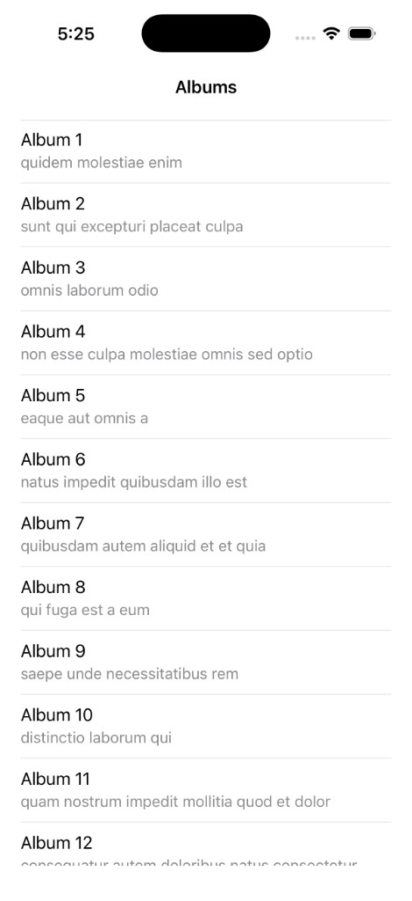
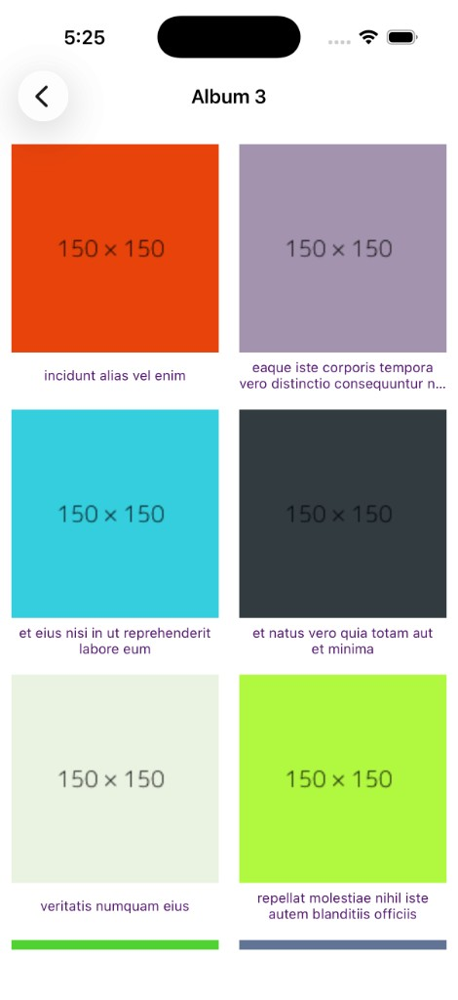
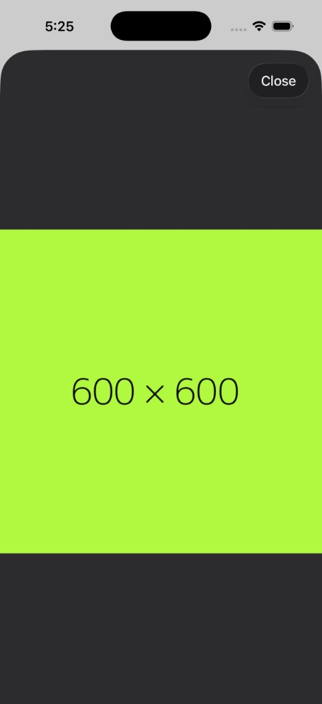

# ImageFetcher

A native iOS app that browses remote albums and photos from [JSONPlaceholder](https://jsonplaceholder.typicode.com) — album list → photo grid → full-screen image viewer.


## Screenshots

| Albums | Photo grid | Full image |
|:---:|:---:|:---:|
|  |  |  |

---

## The app

- Fetches **100 albums** from JSONPlaceholder and displays them in a table (title + description).
- Tap an album → fetches **photos for that album** and shows a **2-column collection grid** with thumbnails and titles.
- Tap a photo → presents a **full-screen image** in a modal navigation stack with a **Close** button.
- **Loading**, **error**, and **retry** states on album and photo screens (`ViewState`).
- Remote images are loaded through a shared **`RemoteImageLoader`** with in-memory cache, disk cache, request deduplication, and safe cell reuse.

---

## The approach

**VIPER-style modules with protocol-driven view models** — each feature owns its View, ViewController, Interactor, Presenter, and Router. Networking and image loading live in dedicated layers; views are built entirely in code (no storyboards).

```
SceneDelegate → UINavigationController → AlbumViewController
                                              │
                    AlbumInteractor → AlbumPresenter → AlbumView (UITableView)
                                              │
                    AlbumRouter ──push──► PhotoViewController
                                              │
                    PhotoInteractor → PhotoPresenter → PhotoView (UICollectionView)
                                              │
                    PhotoRouter ──present──► FullImageViewViewController
                                              │
                    FullImageViewPresenter → UIImageView + RemoteImageLoader
```

| Layer | Responsibility |
|-------|----------------|
| **Interactor** | Fetches data from JSONPlaceholder; returns `Result<[Model], Error>`. |
| **Presenter** | Maps `Result` → `ViewState` and forwards to the view controller. |
| **ViewController** | Triggers fetch, handles retry, wires router callbacks. |
| **View** | Programmatic layout; renders `ViewState` (spinner / content / error). |
| **Router** | Navigation between modules; passes models via `dataStore`. |
| **RemoteImageLoader** | Cache, dedupe in-flight downloads, deliver images on the main queue. |
| **RemotePhotoURL** | Rewrites dead `via.placeholder.com` URLs from the API to a working host. |

**Patterns:** VIPER-style separation, protocol view models, `ViewState<T>`, programmatic Auto Layout, shared singleton image loader.

### ViewState

List screens use a three-case state machine — no silent failures:

```swift
enum ViewState<T> {
    case loading
    case loaded(T)
    case failed(message: String)
}
```

- **loading** → activity indicator overlay  
- **loaded** → table / collection visible  
- **failed** → message + **Retry** button  

### Image loading

#### Why we rewrite image URLs in code

JSONPlaceholder is still the **only data source** for albums, photos, and image paths. Each photo response includes fields like:

```json
{
  "thumbnailUrl": "https://via.placeholder.com/150/92c952",
  "url": "https://via.placeholder.com/600/92c952"
}
```

The app uses those fields directly (`PhotoModel.thumbnailURL` and `PhotoModel.url`). **We do not swap in a different photo API** (e.g. Picsum).

The problem is that **`via.placeholder.com` shut down** — the domain no longer serves images. The JSONPlaceholder API was never updated, so every `thumbnailUrl` / `url` in the response is a dead link. Without a fix, the album and photo lists load fine but **all images appear blank**.

The rewrite happens in one place — `RemotePhotoURL.resolvedURL(from:)` — at **image load time only**:

```
https://via.placeholder.com/150/92c952   ← from JSONPlaceholder API
        ↓ host swap (same path, working CDN)
https://dummyimage.com/150/92c952        ← what URLSession actually fetches
```

**Why in code, not in the model?**

| Approach | Reason |
|----------|--------|
| Rewrite in `RemotePhotoURL` | Keeps models faithful to the API; fix is isolated to the network/image layer |
| Not hard-coded in view models | View models stay dumb — they expose `url` / `thumbnailURL` from JSONPlaceholder |
| Not a different image service | Album/photo JSON still comes from JSONPlaceholder; only the broken CDN host is replaced |

`dummyimage.com` accepts the **same URL path shape** as the old placeholder service and returns PNG data that `UIImage` can decode — which is why a simple host replacement works.

#### Loader behaviour

`RemoteImageLoader` adds:

- `NSCache` for memory
- `URLCache` for disk
- **Request coalescing** — duplicate URLs share one in-flight task
- **Reuse safety** — `UIImageView+RemoteImage` ignores stale callbacks via associated objects
- **`prepareForReuse`** cancels pending image assignments in collection cells

---

## Project layout

```
ImageFetcher/
├── AppDelegate.swift
├── SceneDelegate.swift              Programmatic window + root navigation
├── Common/
│   └── ViewState.swift              loading | loaded | failed
├── Network/
│   ├── NetworkManager.swift         Shared fetch + errors
│   ├── RemoteImageLoader.swift      Cache + dedupe + download
│   ├── RemotePhotoURL.swift         Dead placeholder URL rewrite
│   └── UIImageView+RemoteImage.swift
├── AlbumModule/
│   ├── Model/AlbumModel.swift
│   ├── ViewModel/AlbumViewModel.swift
│   ├── Interactor/AlbumInteractor.swift
│   ├── Presenter/AlbumPresenter.swift
│   ├── Router/AlbumRouter.swift
│   ├── ViewController/AlbumViewController.swift
│   └── View/
│       ├── AlbumView.swift
│       ├── AlbumTableViewCell.swift
│       └── AlbumTableViewDataServices.swift
├── PhotoModule/
│   ├── Model/PhotoModel.swift
│   ├── ViewModel/PhotoViewModel.swift
│   ├── Interactor/PhotoInteractor.swift
│   ├── Presenter/PhotoPresenter.swift
│   ├── Router/PhotoRouter.swift
│   ├── ViewController/PhotoViewController.swift
│   └── View/
│       ├── PhotoView.swift
│       ├── PhotoCollectionViewCell.swift
│       └── PhotoCollectionViewDataServices.swift
├── FullImageModule/
│   ├── ViewModel/FullImagePhotoViewModel.swift
│   ├── Presenter/FullImageViewPresenter.swift
│   ├── Router/FullImageViewRouter.swift
│   └── ViewController/FullImageViewViewController.swift
└── Assets.xcassets/                   AppIcon + AccentColor
```

---

## API

| Endpoint | Used for |
|----------|----------|
| `GET /albums` | Album list |
| `GET /photos?albumId={id}` | Photos in selected album |
| Photo `thumbnailUrl` / `url` | Grid thumbnail + full image (via URL rewrite) |

---

## Run

1. Open **`ImageFetcher.xcodeproj`**
2. Select an iPhone simulator → **Run** (⌘R)
3. Browse albums → tap an album → tap a photo → **Close** to dismiss

**Requires:** Xcode 12+, iOS 14.2+. No CocoaPods, SPM packages, or other dependency managers.

---

## Requirements compliance

Mapped against a typical JSONPlaceholder / UIKit portfolio brief.

### Data & navigation

| Requirement | Status |
|---|:---:|
| Fetch albums from JSONPlaceholder | ✅ |
| Show photos for selected album | ✅ |
| Navigate Albums → Photos → Full image | ✅ |
| Use JSONPlaceholder image URLs | ✅ (API fields used; dead host rewritten at load time) |
| No third-party networking/image libraries | ✅ |

### UI & architecture

| Requirement | Status |
|---|:---:|
| UIKit (not SwiftUI) | ✅ |
| Programmatic UI (no storyboards) | ✅ |
| Clear module / layer separation | ✅ (VIPER-style) |
| Loading state while fetching | ✅ |
| Error state with retry | ✅ |
| Safe image loading in scrolling grid | ✅ (reuse + dedupe) |

---

## Related problems / concepts

| Topic | Where it shows up |
|---|---|
| Image cache + deduplication | `RemoteImageLoader` in-flight handler map |
| Cell reuse / stale async callback | `UIImageView+RemoteImage` associated object guard |
| Result → UI state mapping | `AlbumPresenter` / `PhotoPresenter` + `ViewState` |
| Module routing + data passing | `AlbumRouter`, `PhotoRouter`, `dataStore` |
| Dead CDN host rewrite | `RemotePhotoURL` — `via.placeholder.com` → `dummyimage.com` |

---

## License

**MIT License** — see [LICENSE](LICENSE).

Copyright (c) 2021-2026 Gagan Joshi.

---

**Gagan Joshi** — a UIKit VIPER-style portfolio app for remote album and photo browsing.
